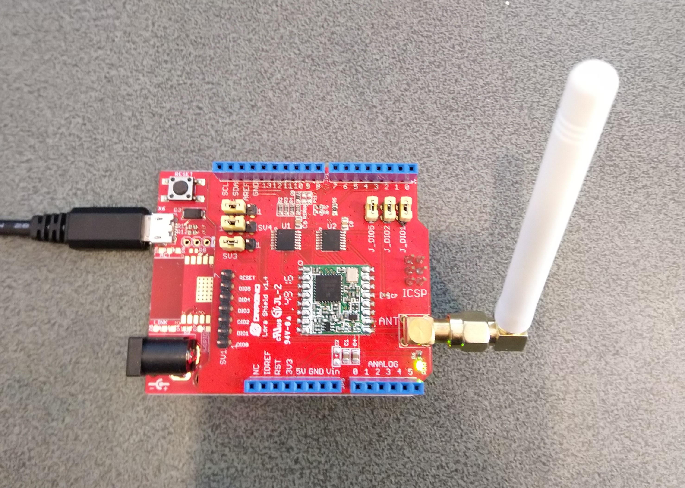
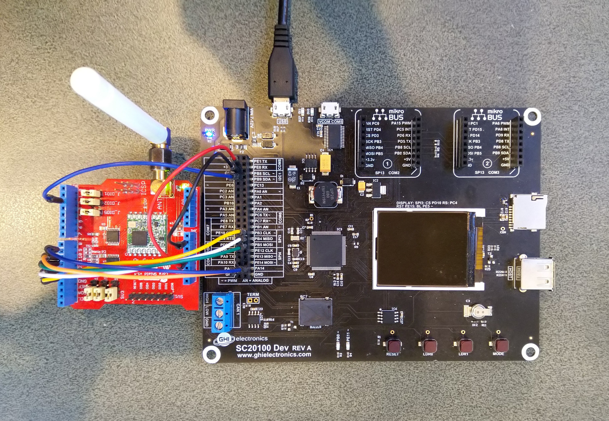

# RFM9XLoRa-TinyCLR
A C# library for [LoRa](https://lora-alliance.org/) connectivity for Semtech [SX127X](https://www.semtech.com/products/wireless-rf/lora-transceivers/SX1276)/HopeRF [RFM9X](http://www.hoperf.com/rf_transceiver/lora/RFM95W.html) equipped shields on [GHI Electronics TinyCLR](https://www.ghielectronics.com/tinyclr/features) powered devices.

The repo has the source code for the series of blog posts written as I built this library for TinyCLR V1, and then updated it to TinyCLR v2

00. [Shield SPI](https://blog.devmobile.co.nz/2020/03/11/tinyclr-os-lora-library-part1/)
01. [Register Scan](https://blog.devmobile.co.nz/2020/03/13/tinyclr-os-lora-library-part2/)
02. [Register Read & Write](https://blog.devmobile.co.nz/2020/03/14/tinyclr-os-lora-library-part3/)
03. [Transmit Basic](https://blog.devmobile.co.nz/2020/03/14/tinyclr-os-lora-library-part4/)
04. [Receive Basic](https://blog.devmobile.co.nz/2020/03/15/tinyclr-os-lora-library-part5/)
05. [Receive Interrupt](https://blog.devmobile.co.nz/2020/03/15/tinyclr-os-lora-library-part6/)
06. [Transmit Interrupt](https://blog.devmobile.co.nz/2020/03/15/tinyclr-os-lora-library-part7/)
07. [Receive & Transmit Interrupt](https://blog.devmobile.co.nz/2020/03/16/tinyclr-os-lora-library-part8/)

[Fully featured V1 driver and sample application](https://blog.devmobile.co.nz/2020/03/16/rfm9x-tinyclr-on-github/) 
* Rfm9xLoRaDeviceClient
* Rfm9XLoRaDevice

The V1 device uses an [Arduino](https://www.arduino.cc/) shield from [Dragino](http://www.dragino.com/products/lora/item/102-lora-shield.html)

00. [ShieldSPI](https://blog.devmobile.co.nz/2020/04/26/tinyclr-os-v2-lora-library-part1/)
01. [Register Scan, Read & Write]()
02. [Transmit & Receive Basic]()
03. [Transmit & Receive Interrupt]()

Fully featured V2 driver and sample application
* Rfm9xLoRaDeviceClient 
* Rfm9XLoRaDevice

The V2 device uses an [Arduino](https://www.arduino.cc/) shield from [Dragino](http://www.dragino.com/products/lora/item/102-lora-shield.html) as I was unable to source a suitable MikroBus click.(April 2020)

